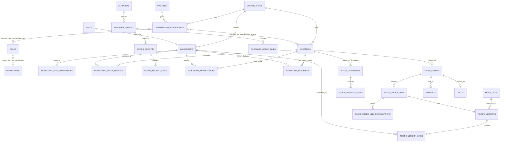

# Tea Chain ERP — Foundation Architecture

## 1. Scope and architectural decisions

This system is a multi-location operational ERP for tea-chain businesses. It uses one PostgreSQL database, while every operational record is isolated by an `organization_id` and, when applicable, a `location_id`. The organization boundary is inexpensive now and avoids a database redesign if franchising, multiple brands, or multiple customers are introduced later.

Key invariants:

- Stock is owned by a location, never by a menu item or by a user.
- Ingredient quantities are stored in each ingredient's base unit only.
- Inventory movements are immutable ledger entries. Snapshots are a read model, not the source of truth.
- Recipes, tax rates, and unit conversions are effective-dated and are copied onto commercial/inventory documents when used.
- Posted financial and stock documents are never hard-deleted. Corrections use reversal or adjustment records.
- All business access is organization-scoped and enforced twice: in services and in PostgreSQL Row Level Security (RLS).

### Bounded contexts

| Context | Responsibility |
| --- | --- |
| Identity & Access | Supabase identity, profiles, roles, permissions, access assignments |
| Master Data | Organizations, locations, suppliers, units, ingredients, menu catalogue, taxes |
| Procurement | Purchase orders, goods receipts, supplier returns |
| Inventory | Immutable ledger, stock snapshots, transfers, adjustments, stock counts, alerts |
| Recipe | Versioned recipes, ingredients per recipe, conversion resolution |
| Sales | Customers, orders, payments, invoices/bills, order lifecycle |
| Reporting | Owner dashboard and read-only aggregated views |

## 2. Folder structure

Feature modules own their screens, schemas, types, services, query hooks, and presentational components. Cross-feature code belongs only in `shared`.

```text
app/
  (auth)/
    login/page.tsx
    verify-otp/page.tsx
  (erp)/
    layout.tsx
    dashboard/page.tsx
    orders/page.tsx
    inventory/page.tsx
    purchases/page.tsx
    transfers/page.tsx
    reports/page.tsx
  api/
    health/route.ts
  layout.tsx
  providers.tsx

modules/
  auth/
    components/ hooks/ schemas/ services/ types/
  dashboard/
    components/ services/ types/
  ingredients/
    components/ hooks/ schemas/ services/ types/
  inventory/
    components/ hooks/ schemas/ services/ types/
  locations/
    components/ hooks/ schemas/ services/ types/
  menu/
    components/ hooks/ schemas/ services/ types/
  orders/
    components/ hooks/ schemas/ services/ types/
  purchases/
    components/ hooks/ schemas/ services/ types/
  recipes/
    components/ hooks/ schemas/ services/ types/
  reports/
    components/ hooks/ services/ types/
  suppliers/
    components/ hooks/ schemas/ services/ types/
  transfers/
    components/ hooks/ schemas/ services/ types/

shared/
  components/          # shadcn/ui composition and generic UI only
  constants/
  hooks/
  lib/                 # query client, date/money helpers, Supabase clients
  types/
  utils/

supabase/
  migrations/
  seed.sql
  functions/           # deferred until a server-only workflow requires one

docs/
  architecture/
  adr/
```

Rules:

- `app` is routing and composition only; it does not contain business rules or Supabase queries.
- Each module's `services` layer is the only place that performs database workflows.
- Every mutation has a Zod input schema. Database types are generated from Supabase and never hand-copied.
- React Query owns server state. Zustand is allowed only for ephemeral UI state (for example, an order composer that survives route-local component changes), never as a duplicate data cache.

## 3. PostgreSQL schema

All domain tables include `id uuid primary key default gen_random_uuid()`, `organization_id uuid not null references organizations(id)`, `created_at timestamptz not null default now()`, and `updated_at timestamptz not null default now()` unless explicitly noted. Master data that can be retired also has `deleted_at timestamptz`. A trigger maintains `updated_at`.

### Identity & access

| Table | Important columns and constraints |
| --- | --- |
| `organizations` | `id`, `name`, `legal_name`, `currency_code char(3)`, `timezone`, `gstin`, timestamps, soft delete |
| `profiles` | `id uuid primary key references auth.users(id)`, `full_name`, `phone`, timestamps, soft delete |
| `organization_memberships` | `organization_id`, `user_id references profiles(id)`, `status`, `joined_at`, unique `(organization_id, user_id)` |
| `roles` | `organization_id nullable` (null = platform/system role), `code`, `name`, `is_system`, unique `(organization_id, code)` |
| `permissions` | `code unique`, `name`, `module`, `description`; examples: `orders.create`, `billing.generate`, `inventory.transfer.create` |
| `role_permissions` | `role_id`, `permission_id`, primary key `(role_id, permission_id)` |
| `membership_roles` | `membership_id`, `role_id`, primary key `(membership_id, role_id)` |
| `user_location_access` | `membership_id`, `location_id`, primary key `(membership_id, location_id)`; absence means no location access, not all locations |

Initial seed roles are data, not code: `OWNER` receives all permissions; `EMPLOYEE` receives only `orders.create`, `orders.read_own_or_assigned_location`, `payments.create`, and `bills.generate`.

### Locations & master data

| Table | Important columns and constraints |
| --- | --- |
| `locations` | `code`, `name`, `location_type`, address/contact fields, `is_active`; `location_type` references `location_types` rather than a PostgreSQL enum so KITCHEN, COLD_STORAGE, and COUNTER can be added as data |
| `location_types` | `code unique`, `name`, `is_stock_holding`; seed WAREHOUSE and SHOP |
| `suppliers` | supplier code/name/contact, tax registration, payment terms, soft delete; unique `(organization_id, code)` |
| `customers` | optional customer profile for sale orders; phone should be unique per organization when present |
| `units` | global canonical unit catalogue: `code`, `name`, `dimension` (MASS, VOLUME, COUNT, CUSTOM), `symbol`, `is_active` |
| `unit_conversions` | global same-dimension conversions: `from_unit_id`, `to_unit_id`, `multiplier numeric(24, 9)`; e.g. L -> ml = 1000. Unique pair |
| `ingredients` | `sku`, `name`, `ingredient_type`, `base_unit_id`, `standard_cost_per_base_unit numeric(18,6)`, `is_stock_item`, soft delete. Unique `(organization_id, sku)` |
| `ingredient_unit_conversions` | ingredient-specific input conversion: `ingredient_id`, `from_unit_id`, `to_base_multiplier numeric(24,9)`, `effective_from`, `effective_to`; unique `(ingredient_id, from_unit_id, effective_from)` |
| `ingredient_stock_policies` | `ingredient_id`, `location_id`, `warning_quantity_base`, `critical_quantity_base`, `reorder_quantity_base`; unique `(ingredient_id, location_id)` |
| `tax_categories` | `code`, `name`, soft delete |
| `tax_rates` | `tax_category_id`, `tax_name`, `rate_percent numeric(7,4)`, `effective_from`, `effective_to`, `is_inclusive`; exclusion constraint prevents overlapping effective periods for a tax category |

`numeric`, not floating-point types, is used for all quantities, costs, and taxes.

### Catalogue & versioned recipes

| Table | Important columns and constraints |
| --- | --- |
| `menu_items` | `sku`, `name`, `item_type`, `sale_price`, `tax_category_id`, `is_active`, soft delete; unique `(organization_id, sku)` |
| `recipe_versions` | `menu_item_id`, `version_number`, `status` (DRAFT, ACTIVE, RETIRED), `effective_from`, `effective_to`, `yield_quantity`, `yield_unit_id`, `published_at`; unique `(menu_item_id, version_number)` and one active effective recipe per item/time period |
| `recipe_version_lines` | `recipe_version_id`, `line_number`, `ingredient_id`, `quantity_per_yield_base numeric(24,9)`; unique `(recipe_version_id, line_number)` |

Recipes are append-only after publication. Editing a recipe creates a new DRAFT version; activating it retires/ends the former version. An order line records the chosen `recipe_version_id` so historical consumption remains reproducible.

### Procurement

| Table | Important columns and constraints |
| --- | --- |
| `purchase_orders` | `po_number`, `supplier_id`, `destination_location_id`, `status`, `ordered_at`, totals, `created_by`; unique `(organization_id, po_number)` |
| `purchase_order_lines` | `purchase_order_id`, `line_number`, `ingredient_id`, entered unit/quantity, canonical `ordered_quantity_base`, unit price/cost/tax snapshot |
| `goods_receipts` | `grn_number`, `purchase_order_id nullable`, `location_id`, `status`, `received_at`, `received_by`; unique `(organization_id, grn_number)` |
| `goods_receipt_lines` | `goods_receipt_id`, `purchase_order_line_id nullable`, `ingredient_id`, input unit and quantity, `received_quantity_base`, `unit_cost_base`, tax snapshot, `inventory_transaction_id` |
| `supplier_returns` / `supplier_return_lines` | reversal document for accepted goods; creates an outbound inventory ledger entry, never erases a receipt |

### Inventory ledger and read model

| Table | Important columns and constraints |
| --- | --- |
| `inventory_transaction_types` | data-driven movement type code, direction (IN/OUT), description; seed PURCHASE_RECEIPT, TRANSFER_OUT, TRANSFER_IN, SALE_CONSUMPTION, WASTE, ADJUSTMENT_IN, ADJUSTMENT_OUT, CUSTOMER_RETURN, SUPPLIER_RETURN, STOCKTAKE |
| `inventory_transactions` | immutable ledger: `id`, `organization_id`, `location_id`, `ingredient_id`, `transaction_type_id`, `quantity_delta_base signed numeric(24,9)`, `unit_cost_base`, `occurred_at`, `source_document_type`, `source_document_id`, `source_line_id`, `idempotency_key`, `created_by`, `reverses_transaction_id nullable`. Checks: nonzero quantity, cost nonnegative, source identity present. Unique `(organization_id, idempotency_key)` |
| `inventory_snapshots` | current projection: `organization_id`, `location_id`, `ingredient_id`, `quantity_base`, `average_cost_base`, `last_transaction_at`, `version`; primary key `(organization_id, location_id, ingredient_id)` |
| `inventory_reservations` | optional later: reserves a known base quantity for an open order/production operation; must not be confused with on-hand stock |
| `stock_counts` / `stock_count_lines` | count sessions and counted base quantities; posting produces the delta adjustment ledger entries |
| `inventory_adjustments` / `inventory_adjustment_lines` | reasoned adjustment document; posting produces ledger lines |

Only a `SECURITY DEFINER` RPC/service transaction can post ledger rows. It writes ledger rows and atomically upserts snapshot rows, rejects negative stock where the organization's policy disallows it, and verifies every source document belongs to the same organization. Direct `INSERT`, `UPDATE`, and `DELETE` against `inventory_transactions` are revoked from browser-facing roles.

### Transfers

| Table | Important columns and constraints |
| --- | --- |
| `stock_transfers` | `transfer_number`, `source_location_id`, `destination_location_id`, `status` (DRAFT, DISPATCHED, RECEIVED, CANCELLED), timestamps/user references, unique `(organization_id, transfer_number)`, check source != destination |
| `stock_transfer_lines` | `stock_transfer_id`, `line_number`, `ingredient_id`, `requested_quantity_base`, `dispatched_quantity_base`, `received_quantity_base` |
| `stock_transfer_events` | append-only status audit with actor and timestamp |

Dispatch posts `TRANSFER_OUT`; receipt posts `TRANSFER_IN`. These have distinct source references and retain in-transit accountability. A cancelled dispatched transfer is corrected by a compensating receipt/back-transfer, not deleted.

### Sales, payment and billing

| Table | Important columns and constraints |
| --- | --- |
| `sales_orders` | `order_number`, `location_id` (must be a SHOP/COUTER sale location), `customer_id nullable`, `status`, `subtotal_amount`, `tax_amount`, `grand_total_amount`, `placed_at`, `created_by`, unique `(organization_id, order_number)` |
| `sales_order_lines` | `sales_order_id`, `line_number`, `menu_item_id`, `item_name_snapshot`, `recipe_version_id`, `quantity`, sale price/discount/subtotal/tax/total snapshots, `fulfilment_status` |
| `sales_order_line_consumptions` | materialized consumption audit: `sales_order_line_id`, `recipe_version_line_id`, `ingredient_id`, `quantity_base`; each row references the resulting inventory transaction |
| `payments` | `sales_order_id`, `payment_method`, `amount`, `status`, payment reference, paid_at, received_by; supports split payments |
| `bills` | `bill_number`, `sales_order_id unique`, legal/business snapshots, subtotal/tax/grand total, issued_at, `status`; unique `(organization_id, bill_number)` |
| `bill_tax_lines` | `bill_id`, `tax_rate_id`, `tax_name_snapshot`, `rate_percent_snapshot`, taxable and tax amounts |
| `sales_order_events` | append-only status/audit history |

At confirmation/payment capture, the service resolves the recipe active at the order's fulfilment time, records it on the line, creates one `SALE_CONSUMPTION` inventory transaction per ingredient, and atomically updates the shop snapshot. Bills are immutable once issued; a cancellation requires credit-note support in a later accounting module.

### Audit and reporting

| Table or view | Purpose |
| --- | --- |
| `audit_log` | actor, action, entity type/id, request/correlation id, before/after JSONB (sensitive fields excluded), occurred_at |
| `v_inventory_on_hand` | joins snapshots with ingredient/location details and stock policy evaluation |
| `v_daily_sales` | finalized/paid sales by organization, location, and local business date |
| `v_ingredient_consumption` | consumption by date, location, ingredient, and recipe version |
| `v_inventory_valuation` | snapshot quantity × average cost, by location and ingredient |

### Required indexes and database protections

- Composite indexes on `(organization_id, deleted_at)`, `(organization_id, status)`, and relevant document dates for all operational tables.
- `inventory_transactions (organization_id, location_id, ingredient_id, occurred_at desc)` for stock trails.
- `inventory_snapshots (organization_id, location_id, ingredient_id)` primary key, plus `(organization_id, ingredient_id)` for cross-location reporting.
- Partial indexes for active records: `where deleted_at is null`.
- Foreign-key columns are indexed. All external document numbers use organization-scoped unique constraints.
- Trigger blocks `UPDATE` and `DELETE` on posted ledger rows, recipe version lines of published recipes, bills, and audit records.
- `updated_at` trigger and audit trigger are installed by migration; application clocks are never trusted as the audit source.

## 4. Entity relationships



## 5. Security model

Supabase Auth owns email/password, email verification, JWT refresh, and optional MFA enrollment/challenge. The UI never decides authorization on its own.

1. `profiles.id = auth.uid()` maps the authenticated user to ERP data.
2. `current_organization_id()` reads a validated active-organization claim or membership context. `has_permission(permission_code, location_id)` resolves membership roles and location assignments.
3. RLS applies `organization_id = current_organization_id()` to every tenant table. Location-bound rows additionally require membership access to that location.
4. Owner permissions grant all configured capability codes through data. Employee permissions are deliberately narrow and remain data-configurable.
5. Browser clients can read permitted views and invoke vetted RPCs. Mutations that post financial documents, transfer inventory, or alter stock are transactional RPCs; privileged Edge Functions are reserved for integrations and asynchronous work.
6. Authentication policy enables confirmed email/password and requires an MFA assurance-level check for owner or privileged actions once Email OTP/MFA is enabled. The exact Supabase MFA factor should be chosen during auth setup based on the provider capabilities available for this deployment.

## 6. Development roadmap

| Phase | Deliverable | Exit criteria |
| --- | --- | --- |
| 0. Foundation | Next.js workspace, strict TypeScript, Tailwind/shadcn, Supabase project config, CI, env validation | lint/typecheck/test/build run cleanly; no secrets in client bundle |
| 1. Identity & authorization | auth, organization switch/context, profile, RBAC tables/RLS, owner/employee seed | employee cannot access master data or inventory endpoints under direct request |
| 2. Master data | locations, units/conversions, ingredients, suppliers, taxes, alert policies | all entry units resolve to a valid base quantity; invalid or ambiguous conversions are rejected |
| 3. Inventory core | immutable ledger RPC, snapshots, stock trail, adjustments/counts, low-stock views | concurrent postings remain consistent; ledger is non-editable; projection reconciles to ledger |
| 4. Procurement & transfers | POs, GRNs, supplier returns, transfer dispatch/receive | receipt and each transfer side creates correct ledger entries atomically |
| 5. Catalogue & recipes | menu items, recipe draft/publish/versioning, recipe cost preview | historical recipe remains unchanged after a new version goes live |
| 6. Sales & billing | customer order, payment, tax calculation, recipe consumption, bill generation | sale posts ingredients at shop and stores price/tax/recipe snapshots atomically |
| 7. Reporting & operations | owner dashboard, filtered reports, exports, audit viewer, alerts | dashboards use indexed read models and agree with source documents |
| 8. Hardening | observability, rate limits, backup/restore rehearsal, load tests, accessibility, security review | target workflows pass under 100-shop scale test profile |

## 7. First implementation slice

Begin Phase 0 and Phase 1 in this order:

1. Scaffold the Next.js App Router project and shared providers.
2. Add Supabase local configuration and migration framework.
3. Implement baseline migrations: extensions, audit/timestamp helpers, organizations, profiles, RBAC, locations, RLS helpers/policies.
4. Generate TypeScript database types and add validated environment configuration.
5. Build login, OTP/MFA checkpoint, protected ERP layout, and permission-aware navigation.
6. Add unit/inventory master data only after authorization tests prove the access boundary.

No inventory, purchase, transfer, or sale UI should be built before the transaction-posting boundary and RLS policy tests exist.
