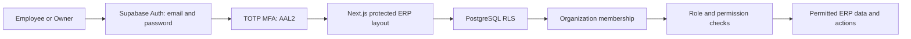

# Tea Chain ERP: Implementation Status and Development Roadmap

**Last updated:** 2026-08-04  
**Status:** Foundation and identity/access phase implemented; live MFA verification is under final integration testing.

## 1. Product purpose

Tea Chain ERP is a production-oriented, multi-location operating system for tea-chain businesses. It is designed for one centralized PostgreSQL database and scales from the current warehouse-and-shops setup to future warehouses, kitchens, cold storage, counters, and additional shops without a database redesign.

Core operating flow:

```text
Supplier -> Warehouse -> Transfer -> Shop -> Customer order
         -> Recipe version -> Ingredient consumption -> Shop inventory ledger
```

Stock belongs to a location and is maintained as ingredients in base units. Menu items are sold to customers but never stored as stock.

## 2. Implemented technology foundation

| Area | Current implementation |
| --- | --- |
| Web application | Next.js 16 App Router, React 19, strict TypeScript |
| Styling | Tailwind CSS |
| Validation | Zod installed and used for authentication and onboarding mutations |
| Server state | TanStack Query installed for upcoming data modules |
| Forms | React Hook Form installed for upcoming complex forms |
| Authentication | Supabase Auth with email/password and cookie-based SSR session handling |
| Database | Supabase PostgreSQL with Row Level Security |
| Authorization | Data-driven roles, permissions, role permissions, and organization memberships |
| MFA | TOTP/Google Authenticator enrollment and verification routes implemented |

Every committed application build has passed:

```text
npm run lint
npm run build
```

## 3. Architecture

### 3.1 Application structure

```text
app/
  (auth)/                 Login routes
  (erp)/                  Protected ERP routes
  (mfa)/                  TOTP enrollment and verification routes
modules/
  auth/                   Authentication schemas, actions, and UI
  inventory/              Reserved for ledger and stock workflows
  ingredients/            Reserved for master data
  locations/              Reserved for warehouse/shop management
  menu/                   Reserved for menu items
  purchases/              Reserved for purchase orders and goods receipt
  recipes/                Reserved for versioned recipe workflows
  transfers/              Reserved for stock transfer workflows
shared/
  lib/supabase/           Browser, server, and session-refresh clients
supabase/migrations/      Versioned database migrations
docs/architecture/        Architecture and operating documentation
```

Feature modules own their UI, schemas, services, types, and query hooks. The `app` directory only composes routes and layouts; it does not contain operational business rules.

### 3.2 Security boundary



The browser UI is not trusted as an authorization boundary. PostgreSQL RLS and security-definer functions independently verify membership, permissions, and MFA assurance.

## 4. Database and authorization implementation

### 4.1 Applied/available migrations

| Migration | Purpose |
| --- | --- |
| `20260804140000_identity_and_rbac.sql` | Organizations, profiles, memberships, roles, permissions, audit log, profile trigger, RLS, and Owner bootstrap function |
| `20260804153000_enforce_totp_and_single_owner.sql` | AAL2 enforcement, one active Owner guard, existing-user Employee assignment function, and MFA-protected RLS policies |

The first migration has been applied in Supabase. The second migration must be run in Supabase SQL Editor before MFA-protected authorization is considered complete.

### 4.2 Roles

Roles are records, never hardcoded branches in UI code.

| Role | Current permissions |
| --- | --- |
| `OWNER` | All seeded permissions: organization/member management, master data, inventory, reporting, orders, payments, and billing |
| `EMPLOYEE` | Create/read orders, record payments, and generate bills |

Only one active Owner can be assigned to an organization. TOTP does not assign a role: it proves the account holder has their authenticator device. A manually created Supabase Auth user has no access to the existing organization until the Owner assigns that user as an Employee.

### 4.3 Current user journeys

1. Owner logs in with email and password.
2. The app requires TOTP enrollment or verification before access to any ERP route.
3. A new Owner creates their organization through onboarding and receives the OWNER role atomically.
4. Owner opens `/team` and assigns an existing, confirmed Supabase Auth account as EMPLOYEE.
5. Employee signs in, enrolls/verifies their own TOTP factor, and receives only employee permissions.

## 5. MFA implementation status

TOTP is enabled in the Supabase project. No paid SMS MFA configuration is necessary.

Implemented routes:

| Route | Responsibility |
| --- | --- |
| `/mfa/enroll` | Enrolls an unprotected account with a new TOTP factor, renders the QR code/secret, then verifies a code |
| `/mfa/verify` | Challenges a previously enrolled factor at each new AAL1 session and upgrades it to AAL2 |
| ERP layout | Redirects users at AAL1 to enrollment or verification; allows ERP access only at AAL2 |

### Current integration note

The QR code data URI rendering and stale-factor handling have been corrected. Supabase's first enrollment creates an `unverified` factor immediately. If a prior QR screen was abandoned, the application removes only an unverified `Tea Chain ERP` factor and starts a fresh enrollment; it never removes a verified factor automatically.

The final verification failure is currently being diagnosed with exact Supabase API errors exposed in the UI. When the next test is performed, record the specific red error message after entering the current six-digit authenticator code. That response will determine whether the remaining issue is code timing, a challenge/session error, or project-level verification configuration.

## 6. Important operational configuration

- Keep actual environment values in `.env` or `.env.local`; Next.js does not load `.env.example`.
- Keep `.env.example` as safe placeholder documentation before committing changes.
- `SUPABASE_URL` and `SUPABASE_PUBLISHABLE_KEY` support current server-side flows.
- Future browser data modules should also receive `NEXT_PUBLIC_SUPABASE_URL` and `NEXT_PUBLIC_SUPABASE_PUBLISHABLE_KEY` aliases.
- Do not add a Supabase service-role key to browser code or public environment variables.
- Enable Email/Password in Supabase Auth and require verified email accounts for employee assignment.

## 7. Architecture decisions already made

| Decision | Reason |
| --- | --- |
| Organization boundary from day one | Supports multiple businesses/franchises while still using one database |
| UUID primary keys | Safe distributed identifiers and external references |
| Immutable inventory ledger plus snapshot | Complete audit trail and fast current-stock reads |
| Ingredient-only inventory | Menu items are recipes, not stock |
| Base-unit storage | Avoids arithmetic ambiguity across kilograms/grams, litres/ml, and ingredient-specific spoons/cups |
| Effective-dated recipe versions | Historical orders continue to use the exact recipe in force at sale time |
| Data-driven locations | New location types such as kitchen or cold storage do not require schema redesign |
| Role/permission tables | Manager or future capabilities can be added without hardcoded role checks |
| MFA AAL2 in RLS | Direct API callers cannot bypass the web route guard |

For the complete target database design, see `docs/architecture/erp-foundation.md`.

## 8. Next phase: master data and inventory foundation

The next implementation phase begins after the second migration is applied and the Owner can complete a TOTP login.

### 8.1 Master data deliverables

1. Locations and location types: WAREHOUSE and SHOP initially; KITCHEN, COLD_STORAGE, and COUNTER data-ready.
2. Units and global conversions: kg/g/mg, L/ml, pieces, packets, bottles, tablespoons, teaspoons, and cups.
3. Ingredients with base unit, SKU, standard cost, stock policy, and soft delete.
4. Ingredient-specific conversions, for example sugar tablespoon to grams versus tea tablespoon to grams.
5. Suppliers, tax categories, and effective-dated GST rates.
6. Owner-only screens and Zod-validated services for each master-data workflow.

Acceptance criteria:

- A non-owner cannot read or mutate master data.
- A quantity entered in any supported unit resolves exactly to an ingredient base quantity.
- Ambiguous conversions are rejected, never guessed.
- Soft-deleted master data stays available to historical documents.

### 8.2 Inventory core deliverables

1. Immutable `inventory_transactions` ledger.
2. Current-stock `inventory_snapshots` projection.
3. Transaction-posting database RPC that atomically writes the ledger and snapshot.
4. Purchase receipt, adjustment, waste, stock count, and transfer transaction types.
5. Negative-stock protection policy, idempotency keys, and reconciliation reports.
6. Low-stock and out-of-stock views using location-specific alert policies.

Acceptance criteria:

- Ledger rows cannot be updated or deleted.
- Snapshot balances reconcile to the ledger.
- Concurrent posts cannot corrupt stock.
- Every quantity is stored in its ingredient's base unit.

## 9. Planned phases after inventory core

| Phase | Scope | Key outcome |
| --- | --- | --- |
| Procurement | Suppliers, purchase orders, goods receipt, supplier returns | Warehouse stock enters through traceable receipts |
| Transfers | Draft, dispatch, receive, cancel/compensate transfer workflows | Warehouse-to-shop movements post both ledger sides |
| Recipes and menu | Menu catalogue, recipe drafts, publishing, versions | Sales use a reproducible ingredient recipe |
| Sales and billing | Customer orders, payment, GST calculation, bill generation | Finalized sales consume shop ingredients atomically |
| Reporting | Sales, revenue, consumption, valuation, stock, alerts | Owner dashboard uses read-only, indexed views |
| Hardening | Backups, observability, load tests, accessibility, audit review | Reliable operation at 100+ shops |

## 10. Immediate checklist

- [ ] Apply `20260804153000_enforce_totp_and_single_owner.sql` in Supabase SQL Editor.
- [ ] Restart the Next.js development server after code changes.
- [ ] Complete TOTP enrollment with a newly generated code.
- [ ] If verification fails, capture the exact red Supabase error from the enrollment screen.
- [ ] Confirm the Owner reaches `/dashboard` at AAL2.
- [ ] Create a confirmed test employee in Supabase Auth and assign it through `/team`.
- [ ] Begin the master-data migration after the above access-control checks pass.
